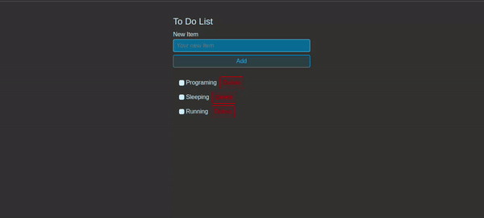

<h1 align="center">React Todo Application</h1>

  

Download the .zip and unziped it or clone the project

cd ReactToDoApplication

npm start

Any feedback or suggestion will be appreciated. ^^

    The Class is here:
    <a href="https://www.youtube.com/watch?v=Rh3tobg7hEo">
        Learn React with this One Project
    </a>

